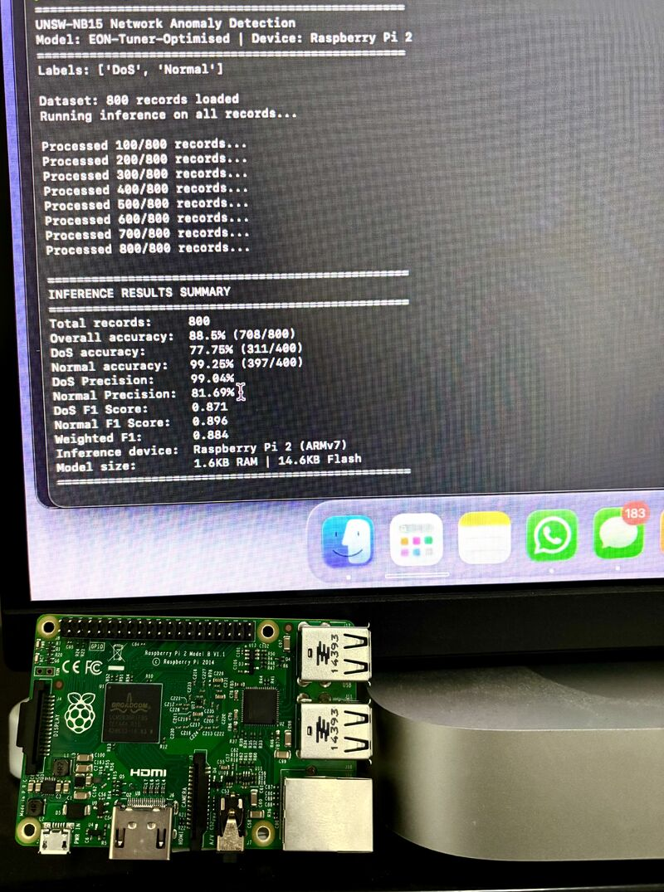

# TinyML Network Anomaly Detection (UNSW-NB15 & Raspberry Pi 2)

A dual-layer network intrusion detection system that runs fully offline on a $45, decade-old Raspberry Pi 2. It shows that useful machine-learning security monitoring doesn't need enterprise hardware or a cloud connection.

Built for **MLP301 Machine Learning Principles**, Torrens University Australia (Assessment 2: Design · Assessment 3: Prototype & Deployment).

## Overview
Traditional intrusion detection systems assume enterprise-grade hardware, rely on static signatures that struggle with novel zero-day threats, and often route telemetry to the cloud, which adds latency and privacy risk. This project asks whether a viable ML pipeline can run on older, budget-friendly edge hardware instead, keeping all inference local to secure resource-constrained IoT environments.

## Key Performance Metrics
* **Target Hardware:** Raspberry Pi 2 Model B (2014, ARMv7, 1 GB RAM, 900 MHz quad-core Cortex-A7), approx. $45
* **Accuracy:** 84.30% on a held-out test split (binary classification: Normal vs. DoS)
* **Memory Footprint:** ~1.6 KB RAM / ~14.6 KB Flash (compiled int8 model)
* **Inference Latency:** <1 ms per sample
* **Deployment Mode:** Fully offline, air-gapped edge node

## Architecture & Methodology

### Five-stage pipeline
1. UNSW-NB15 traffic data is filtered and preprocessed with custom Python scripts
2. The data is uploaded to Edge Impulse for training
3. Features are reduced, and the model is tuned with the EON Tuner
4. The model is quantised to int8 and compiled to an optimised Linux ARMv7 binary (C++)
5. The model is deployed to the Raspberry Pi 2 for live, offline inference

### Dual-layer defence
1. **Supervised neural network:** binary classification of Normal vs. DoS traffic for known attack vectors (16 → 15 → 5 dense architecture selected via EON Tuner).
2. **Unsupervised K-means anomaly block:** flags structural outliers and attack patterns absent from the training data, for potential zero-day detection.

### Data
* 800 records from UNSW-NB15, evenly split between Normal and DoS traffic
* 49 raw attributes reduced to **6 features** by information gain: duration, protocol, source bytes, destination bytes, connection state, and service type
* Evaluated against a 121-record held-out test split, so metrics reflect unseen data

## Iteration & Design Decisions
The project went through a 13-stage iteration log (see `/assessment`).

* Baseline models reached ~81% accuracy.
* An early quantised model reached **88.5% accuracy, but DoS recall fell below 78%**. Because a missed attack is the costliest failure mode in intrusion detection, this model was not selected.
* Targeted data augmentation caused later int8 models to collapse into high false-positive rates, so those pipelines were rejected.
* The final int8 model is a deliberate security trade-off. It gives higher DoS recall at the cost of a small rise in false alarms on normal traffic.

## Findings & Limitations
* **Separability ceiling:** UMAP visualisation shows short-duration, low-byte DoS probes overlapping structurally with legitimate traffic. Reducing to six features conflates different DoS sub-types, which threshold tuning alone can't fix.
* **Recall variance:** cross-validation across held-out splits gave a DoS recall range of 60.4%–75.0%. False negatives remain the key risk.
* **Non-deterministic tuning:** the EON Tuner produced different results on each run, so automated hyperparameter search still needs manual verification.
* **Future work:** add secondary packet-header fields or temporal sliding windows to the feature pipeline to separate overlapping attack patterns.

## Demonstrations

### Live hardware demo
A Python wrapper binds to the network interface, processes real-time flows, and classifies them with the compiled C++ model, entirely offline.

https://github.com/user-attachments/assets/c874e73e-b0ff-4367-89e6-9852ad2a4504

### Batch dataset inference
https://github.com/user-attachments/assets/6b80cb84-8cbe-45b2-a703-c528225f4c16

### Full presentation
[▶ MLP301 Assessment 3 presentation](demonstrations/mlp301-presentation.mp4)

## Public Project Link
* **Edge Impulse:** [View the public project](https://studio.edgeimpulse.com/public/1063922/latest)

## Repository Structure
* `/assessment`: Formal written documentation, reports, and the iteration/experiment log.
* `/assets`: Hardware photos, results screenshots, and the iteration performance chart.
* `/dataset`: Raw and processed CSV files (`unsw_nb15_augmented_v2.csv`, `unsw_nb15_filtered.csv`) along with mapping and testing subsets.
* `/demonstrations`: Live hardware demo, batch inference demo, and the full assessment presentation.
* `/logs`: Inference and experiment logs.
* `/scripts`: Python scripts for data filtering (`filter_dataset_v2.py`), DoS sample augmentation (`augument_dos_samples.py`), live network capture (`live_capture.py`), and on-device inference (`run_inference.py`).

## References
* Moustafa, N., & Slay, J. (2015). UNSW-NB15: A comprehensive data set for network intrusion detection systems. *MilCIS 2015*. https://doi.org/10.1109/MilCIS.2015.7348942
* Edge Impulse. (2024). *Edge Impulse documentation.* https://docs.edgeimpulse.com/

## License
This project is licensed under the 3-Clause BSD License.
